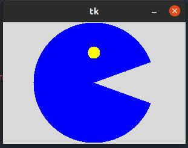

## ejercicio 5_canvas
## arc
### esto es un medio circulo con ojos que tiene movimiento es similar a un videojuego

## circulo
### esto es una pelota con movimiento que se desplaza por todos lados revotando

## imagen 
### aca nos muestra como una imagen tiene movimiento en la ventana

## lineas
### aca nos muestra una cuadricula en la ventana

## poligono
### aca nos muestra un poligono de color amarillo en la ventana

## rectangulo
### aca nos muestra un rectangulo amrillo con borde azul 

## text
### aca nos muestra una frase que al acercar el cursor cambia de color 

