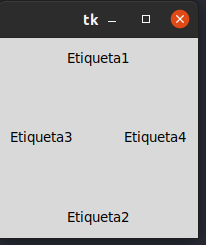
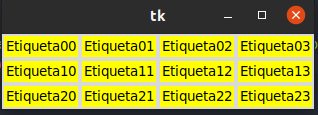
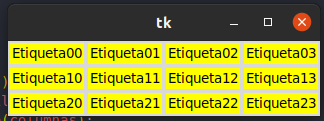
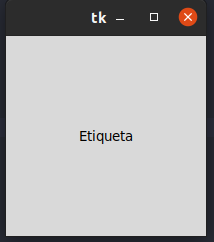

# ejemplos_tkinter_2

## gestor de geometria pack

### Este gestor de geometria disrtribuye los vidye los widgets en horizontal o en vertical.

##con grid de la disrtibucion de los widgets se realiza de una manera  mas fexible, utilizando un diseño de cuadricula. de esta manera cada widge en celda determinad por la interseccion de una fila y una columna.

## Gestor de geometria place 

### Este gestor permite colocar los widgets en coordenadas especificas de la ventana principal o del widget contenedor .
